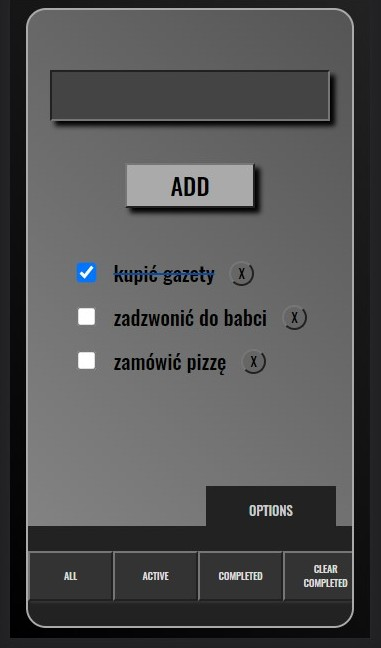

# todoApp_FE_and_BE

> Simple TODO App made by me for contest at MegaK learning platform.

## Table of contents

- [Colors key](#colors-key)
- [General info](#general-info)
- [Screenshots](#screenshots)
- [Technologies](#technologies)
- [Features](#features)
- [Inspiration](#inspiration)
- [Contact](#contact)

## Colors-key

## General info

I have made this app during Express.js block. It is my first thin I have ever made in Express.js on my own.

## Screenshots

### Main view

### Mobile view

## Technologies

- HTML
- CSS
- Javascript
- Node.js
- Express.js

## Features

Live demo https://whatihavetodo.herokuapp.com/

## Status

Project is: finished

## Inspiration

Project inspired by instructors of MEGAK project.

## Contact

Created by [przemoszadkowski@o2.pl](mailto:user@example.com) - feel free to contact me!
